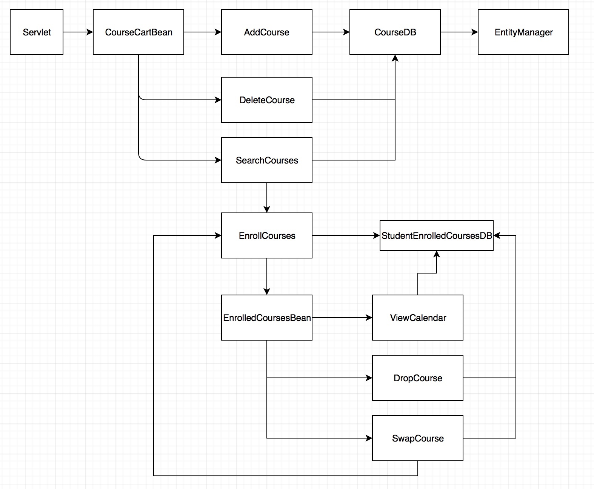
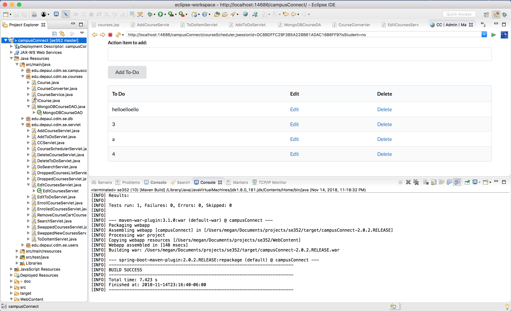
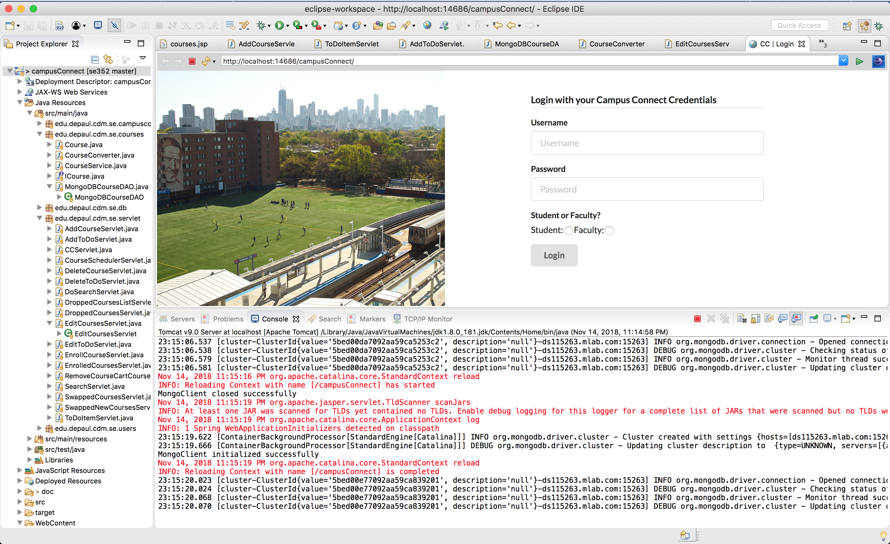

# Campus Connect 2.0

## Overview
This version of campus connect will have a simple way to register for classes, swap out the classes you’re in, and drop classes. It will allow administrators of the site to add, edit, and delete classes that students can enroll in as well as add tasks for students to see and mark completed.

## Requirements
#### Use Cases

###### Course Cart
  - [x] Searching for classes to take.
  - [x] Adding classes to your course cart.
  - [x] Removing classes from your course cart.

###### Registering for courses
  - [x] Enrolling in classes.
  - [x] Dropping classes and viewing dropped classes.
  - [x] Swapping a class you’re enrolled in for a class in your course cart.

###### Administrative functions
  - [x] Create classes as an administrator.
  - [x] Delete classes as administrator.
  - [x] Edit Classes as administrator.

###### Tasks/ToDo Capabilities
  - [x] Admins create tasks for students to see and complete.
  - [x] Admins edit tasks.
  - [x] Admins delete tasks.
  - [x] Students view and mark tasks complete.

## Description of Problem
The current campus connect is very bulky and hides key features. Campus Connect 2.0 will make it easy to enroll and handle coursework - one of it’s most essential features.

## Design

#### Pages

#### Web UI (Common case)

We used Figma to create our mockups, which can be viewed online [here](https://www.figma.com/proto/Ub1tHRVjUMjIERpcn5I7ZlFr/CampusConnect2.0?node-id=0%3A1&scaling=min-zoom&redirected=1).

#### Table Layout

MLab Account: Username = `campusConnectProject` Password = `ccp123`

We’ve added MongoDB to our project for persistence through MLab. We have six tables/collections currently.

We will need a table to all available courses to take (1), a table to track courses in a student's course cart (2), a table
to track which courses a student is enrolled in (3), a table to track what courses a student has dropped (4), a table to track tasks/todo items (5), a table to track completed todo items (6).

###### AllCourses
|courseId|courseName|courseDescription|courseLocation|courseProfessor|courseTimes|
| :------------- | :------------- | :------------- | :------------- | :------------- | :------------- |
|objectId|string|string|string|string|string|

###### CourseCartCourses
|courseId|courseName|courseDescription|courseLocation|courseProfessor|courseTimes|
| :------------- | :------------- | :------------- | :------------- | :------------- | :------------- |
|objectId|string|string|string|string|string|

###### EnrolledCourses
|courseId|courseName|courseDescription|courseLocation|courseProfessor|courseTimes|
| :------------- | :------------- | :------------- | :------------- | :------------- | :------------- |
|objectId|string|string|string|string|string|

###### DroppedCourses
|courseId|courseName|courseDescription|courseLocation|courseProfessor|courseTimes|
| :------------- | :------------- | :------------- | :------------- | :------------- | :------------- |
|objectId|string|string|string|string|string|

###### Tasks
| taskId    | item    |
| :------------- | :------------- |
| objectId       | string      |

###### CompletedTasks
| taskId    | item    |
| :------------- | :------------- |
| objectId       | string      |

#### Sequence of major functionality from user interface to persistence

###### Admin View

- Add/edit/delete courses from all courses table
- Add/edit/delete tasks from tasks table

###### Student View

- Search for and add/remove classes from course cart
- Enroll in, swap an enrolled class with a course cart class, or drop an enroll class
- View and mark tasks complete

(Please view milestones for a more specific breakdown of week-to-week)

#### Lessons Learned

- How to use Maven
- How to make a server side application
- JSP & MVC
- Tomcat

(Please view milestones for a more specific breakdown of week-to-week)

#### Decision log and consequence of the decision

(Please view milestones for a more specific breakdown of week-to-week decisions made a their consequences)

#### Discussion about the lessons learned

A good majority of this course was new information to us. We understood java, objected-oriented patterns, web development, and some of the concepts related to distributed systems, like security. To build a server-side application from scratch was a really cool and valuable experience. We all had only used Ant in the past for our builds, so Maven was a new experience. We were glad to have worked as a group as we were able to pair program and work through our problems together and have an app with more functionality.

(Please view milestones for a more specific breakdown of week-to-week)

#### How Design Meets the Requirements
The requirements were to have 3 major functionalities, use a database, and Javascript and HTML - essentially a web UI. As we’d like to team up for this assignment, we have proposed 12-14 key functionalities to increase difficulty appropriately. We are planning to need some tables for the database component, but how many exactly will be determined as we move forward with design. Finally, this will be a web version of Campus Connect, so we’ll be using HTML and Javascript for our Web UI.

## Team Work Breakdown

|Megan|Aaron|Artur|
| ------------- | ------------- | ------------- |
|Create classes as an administrator.|Adding classes to your course cart.|Searching for classes to take.|
|Delete classes as administrator.|Removing classes from your course cart.|Admins create tasks for students to see and complete.|
|Edit Classes as administrator.|Enrolling in classes.|Admins edit tasks.|
|Admins create tasks for students to see and complete.|Dropping classes and viewing dropped classes.|Admins delete tasks.|
|Mockups|Swapping a class you’re enrolled in for a class in your course cart.|Students view and mark tasks complete.|

As a team, we have worked on many projects together over the last 2 years. If a team member is unable to deliver for whatever reason, we are able to cover some of the work for them. Since we know each other well, we know we won’t have consistent delivery issues.

#### Final Screenshots

