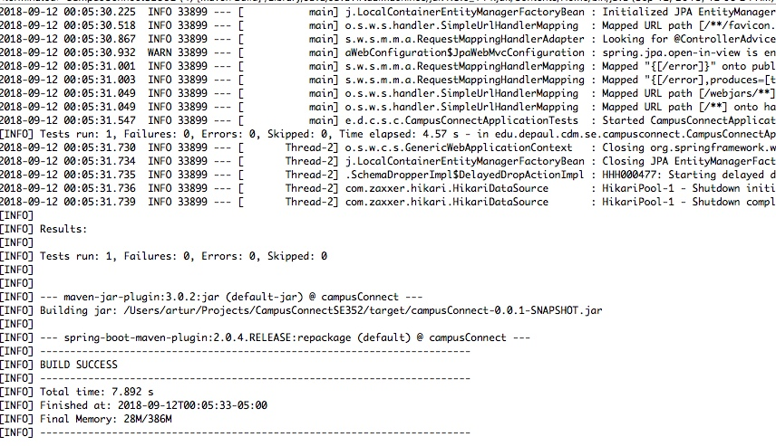

September 12, 2018

## Milestone 1

###### Sequence of major functionality from user interface to persistence

The major functionality this week was setting up the project and running the build. There is no user interface or persistence yet.

###### Lessons learned

- How to use Maven
- Project structure of the server side of an application

###### Decision log and consequence of the decision

We have decided this week to work as a group. We have worked on projects in the past together and being that we're all graduating at the end of this quarter, we figured it would be good to work as a group to hold ourselves accountable not only to ourselves but to each other.

The other main decision we made this week was to work on an application like Campus Connect. We don't like the redesign, but we are really familiar with the functionality, so we figured that would be a good site to emulate.

###### Discussion about the lessons learned

We had never used Maven before, only Ant, so there was a bit of a learning curve in how pom files are set up. We also have never had to make a server side application, so this will pretty much all be new to us.

