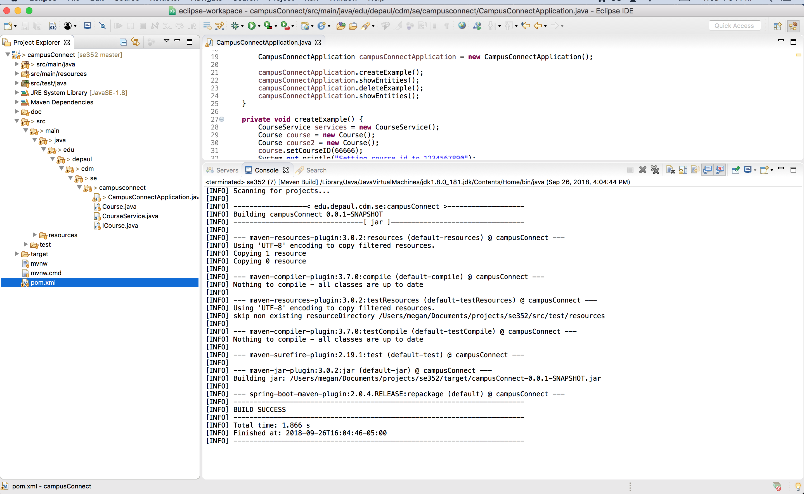
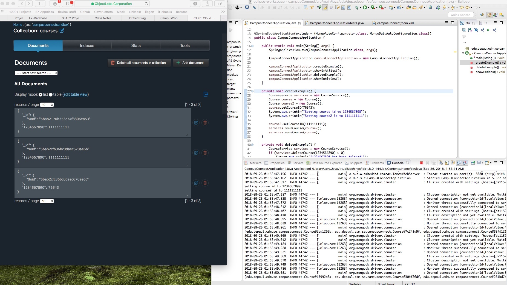

September 26, 2018

## Milestone 2

###### Sequence of major functionality from user interface to persistence

This week we connected our application to MLab. We are able to run the application to start the connection and enter and remove some hardcoded data into our database and `console.log` the events. There is no user interface yet.

###### Lessons learned

- MLab and MongoDB
- Connecting MLab with a java application

###### Decision log and consequence of the decision

We decided to use MLab because we had some very basic familiarity with it and MongoDB, and wanted to learn more about those and NoSQL.

###### Discussion about the lessons learned

We were only a bit familiar with MLab, as in someone else had set it up in a different group project and we barely interacted with it. We had to consult several tutorials in how to get this set up. Aaron and Artur were the ones who did the majority of the work this week as Megan was at a conference for the good majority of the time.

