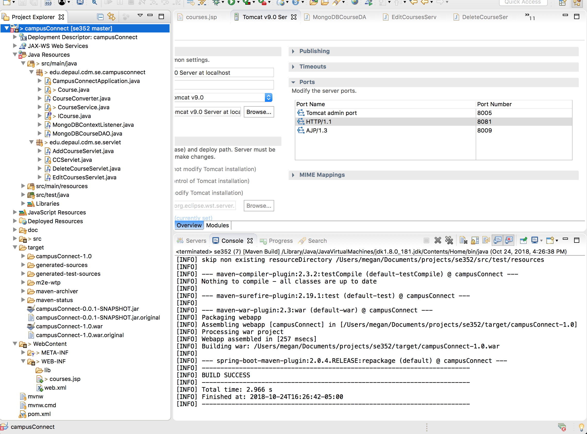
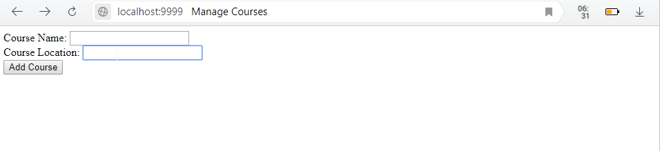

October 24, 2018

## Milestone 3

###### Sequence of major functionality from user interface to persistence

This week we created mockups for our app and connected our front-end to our backend. We at this point can add, edit, and delete a course to/from our database from the jsp page.

###### Lessons learned

- Servlets
  - Using MLab/MongoDB with servlets
  - Connecting JSP page to servlet
- JSP
- Setting up a local Tomcat server
  - How to set it up in Eclipse as well

###### Decision log and consequence of the decision

We decided to use Figma to create our mockups. Megan for the most part created the [mockups](https://www.figma.com/proto/Ub1tHRVjUMjIERpcn5I7ZlFr/CampusConnect2.0?node-id=0%3A1&scaling=min-zoom&redirected=1). We have used Figma for other classes to create mockups and we like it because it's collaborative and easy to use.

We greatly considered changing from MLab/MongoDB to JDBC/JPA and SQL because there was so little information on MLab and Java applications and we had some issues getting the the servlets to communicate with MLab. We relied a lot on this [tutorial](https://www.journaldev.com/4011/mongodb-java-servlet-web-application-example-tutorial) to get us started and it caused us to run into quite a few issues that needed to be resolved as this was done with a local MongoDB rather than with MLab, which needed just a couple of changes and caused some confusion. Overall, we decided to stay with MLab once we figure out more so how it works.

Megan wanted to run Tomcat within Eclipse, so she changed the project structure to make it a Dynamic Web Application so it could be run on the server through Eclipse.

###### Discussion about the lessons learned

We figured out the servlets finally and how to connect them to MLab. The servlets were pretty easy to connect to the JSP pages with the annotations, and JSP was ok to figure out, we definitely had to do a little research on that one.

We were annoyed by having to continually build and deploy the .war file from Eclipse to the Tomcat server, so we decided to figure out how to run it through Eclipse. That took a bit of time, configuration, and Stack Overflow searching. It ended up changing our project structure, which took a moment to get used to, but did ultimately make it easier to develop.

JSP is just a learning process. We don't have much more to say on that.

