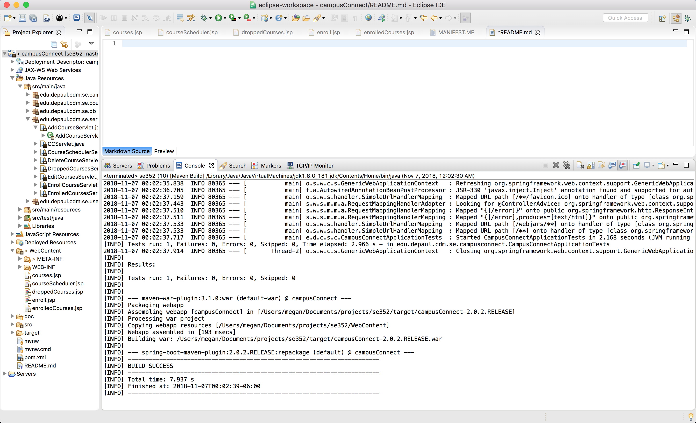
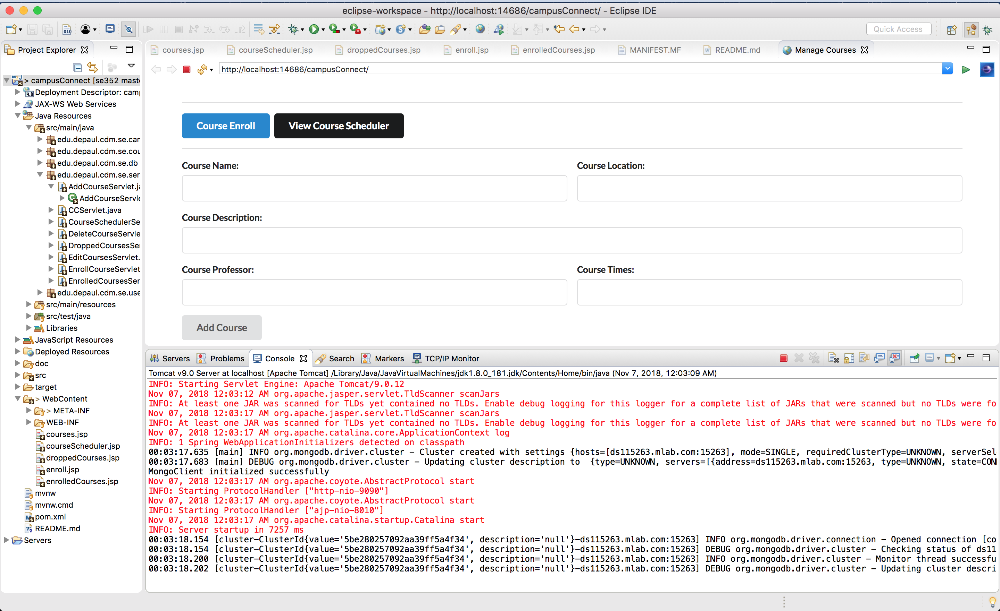

November 7, 2018

## Milestone 4

###### Sequence of major functionality from user interface to persistence

We currently are not differentiating between students and admins.

Every user can currently add a new course to the list. Users are yet to be defined.

The current user can then view all the courses, enroll in courses, and drop courses, and view the courses in each of those states. We save all of these states and each user sees the same thing. We have not implemented separate users (at least as of yet).

###### Lessons learned

- JSP
- Developing from mockups

###### Decision log and consequence of the decision

In this milestone, we decided to use a css library to style our site rather than rely on our mockups and do the styles ourselves. We decided to use Semantic-UI as it is pretty and easy to use, and it gave us the feel we were looking for, though we did look at Bootstrap and Material as options. Those were too light-weight for us.

###### Discussion about the lessons learned

If we had a bit more time and decided this sooner, we would have preferred to use a library like React or framework like Angular to make the front-end easier to deal with and have the ability to dynamically show content out of the box, ie. not have to reload the page each time an action is completed.

We were, we feel, too ambitious in our original mockup as to what we would be able to accomplish design wise. In using Semantic, it negated a majority of the design design decisions we made in the beginning, but the mockups were incredibly helpful in helping us decide the flow of the the pages and what should be included on each page, even though we didn't follow the design exactly.

